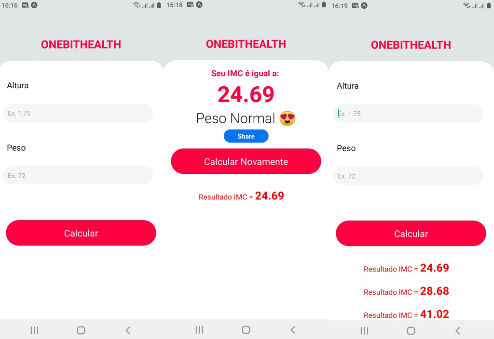

# ❤️ One Bit Health 💊

## :page_with_curl: About/Sobre

  
<strong>:us: English</strong>

 
  Mobile project developed by <a href="https://www.linkedin.com/in/eliasef/">Elias Ferreira</a> that calculates your BMI and displays your BMI history, in addition to being able to share it.
  

  
<strong>:brazil: Português</strong>

 
Projeto mobile desenvolvido por <a href="https://www.linkedin.com/in/eliasef/">Elias Ferreira</a> que calcula seu IMC e exibe seu histórico de IMC, além de poder compartilhá-lo.

## :man_technologist: Developed Skills/Habilidades Desenvolvidas

  
<strong>:us: English</strong>

 
Developed through React Native, using functional components and React Hooks, FlatList was also used to render each of the IMC'S, which are stored in an array of objects called imcList, the app consumes the following API's:
<ul>
  <li>Vibration</li>
  <li>Share</li>
</ul>

  
<strong>:brazil: Português</strong>
 

Desenvolvido através do React Native, utilizando componentes funcionais e React Hooks, também foi utilizado FlatList para renderizar cada um dos IMC'S, que são armazenados em um array de objetos chamado imcList o app consume as seguintes API's: 
<ul>
  <li>Vibration</li>
  <li>Share</li>
</ul>

## :hammer_and_wrench: Tools/Ferramentas

* React Native
* React Hooks
* Functional Components
* Vibration API
* Share API